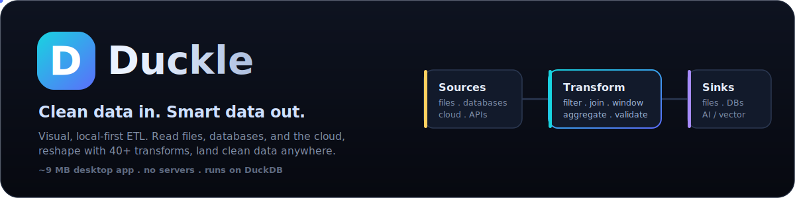
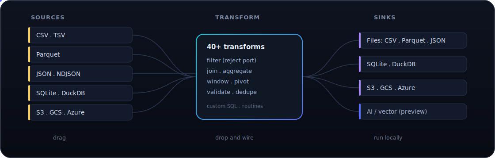
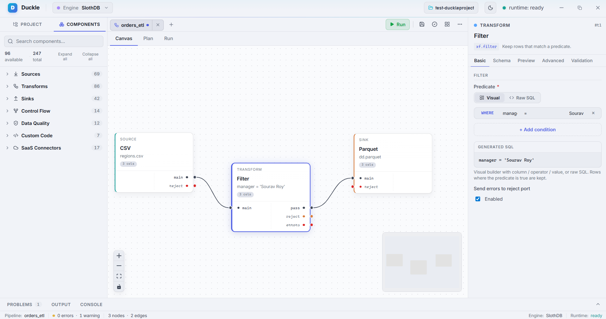
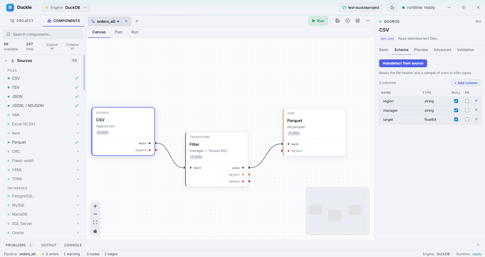
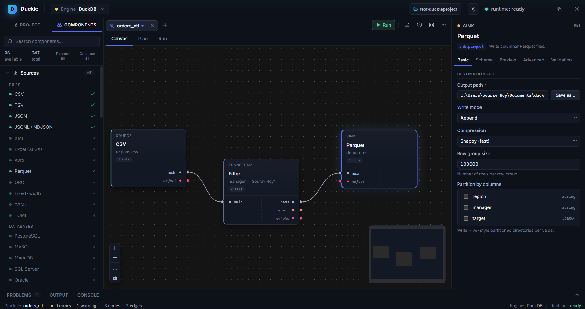

<div align="center">



<h3>The local-first data studio. Drag, wire, run at native speed.</h3>

<p><b>Duckle</b> is an open-source, local-first <b>ETL / ELT studio</b>: a drag-and-drop pipeline designer that compiles your canvas to SQL and runs it on your machine through DuckDB. Read from files, databases, and the cloud; reshape with 40+ transforms; land clean data in files, databases, object storage, and your AI / vector stores. Ships as a ~9 MB desktop app, no bundled database, no servers, no lock-in.</p>

<p>


</p>

</div>

---

## What is Duckle?

Most data tooling forces a choice: a heavyweight enterprise suite you have to host, or a pile of scripts you have to maintain. Duckle is the middle path, a visual studio that runs entirely on your machine and stays out of your way.

You build a pipeline by dragging nodes onto a canvas and wiring them together. Duckle compiles that graph into SQL and executes it on a real analytical engine. Nothing is hidden: click any node to read the **generated SQL** and see a **live preview** of the rows flowing through it.

<div align="center">

</div>

### Why Duckle is different

| | |
|---|---|
| **Visual, never opaque** | The canvas compiles to SQL you can read, and every node has a live preview tab. No black box. |
| **Tiny binary, no bundled DB** | The app is ~9 MB. The DuckDB engine downloads on first launch with a guided step, so installs stay small and updates stay fast. |
| **Native speed** | Execution runs through DuckDB: vectorized, columnar, local. A clean-and-export job that crawls in a spreadsheet finishes in milliseconds. |
| **Git-friendly by design** | Pipelines, connections, contexts, and routines persist as plain files in a folder you pick. Diff them, branch them, review them. |
| **Honest about scope** | Single-machine and embedded by design. Built to make local and small-team data work fast, not to replace a distributed warehouse. |
| **Open source** | Dual-licensed MIT OR Apache-2.0. Yours to use, fork, and extend. |

---

## Status

Duckle is in **early development**. The visual designer, the DuckDB execution engine, scheduling, and cloud sources work today and are covered by integration tests. The surface area is still moving fast, the connector catalog is growing, and APIs may change. Treat it as a promising daily-driver-in-progress, not a 1.0.

**Scope, stated plainly:** Duckle is a single-machine, embedded studio. If you outgrow one box, point Duckle's output at the system that scales. It will not pretend to be a cluster.

The component palette ships 240+ nodes so the roadmap is visible in the product itself. Each node is tagged by availability:

- **Available** runs on the DuckDB engine today.
- **Preview** is configurable in the designer now (drag, wire, set properties); execution is being wired engine-by-engine. This currently covers the AI and Vector / AI Database groups.
- **Planned** is on the roadmap and reserved in the palette, not yet executable.

The capability matrix below marks each area accordingly.

---

## Screenshots

<p align="center">
  
  <br/>
  <sub>Build a pipeline on the canvas, configure a node, and read the generated SQL. Here a CSV source flows through a Filter into a Parquet sink.</sub>
</p>

<p align="center">
  
  
</p>
<p align="center">
  <sub>Left: the component palette and one-click schema autodetect from the source. Right: sink configuration with write mode, compression, and partitioning, in dark theme.</sub>
</p>

---

## Capabilities

Duckle is not a CSV tool with extras. It reads a broad set of formats and sources, ships a deep transform library, and writes to files, databases, object storage, and AI stores. CSV is just one source among many.

### Sources

| Group | Connectors | Status |
|---|---|---|
| **Files** | CSV, TSV, Parquet, JSON, JSONL / NDJSON | Available |
| **Embedded databases** | SQLite (read tables), DuckDB (read tables or run a query) | Available |
| **Object storage** | Amazon S3, Google Cloud Storage, Azure Blob, HTTP(S) via DuckDB `httpfs` | Available |
| **Relational databases** | PostgreSQL, MySQL, MariaDB, SQL Server, Oracle, ClickHouse, generic JDBC | Planned |
| **Cloud warehouses** | Snowflake, BigQuery, Redshift, Databricks SQL, Synapse, MotherDuck | Planned |
| **Streaming** | Kafka, Pulsar, Redpanda, NATS, Kinesis, Event Hubs, Pub/Sub | Planned |
| **APIs and SaaS** | REST, GraphQL, gRPC, plus Salesforce, HubSpot, Stripe, Notion, GitHub, and more | Planned |
| **NoSQL and search** | MongoDB, Cassandra, Redis, DynamoDB, Elasticsearch, OpenSearch | Planned |
| **Vector / AI databases** | pgvector, Pinecone, Qdrant, Weaviate, Chroma, Milvus, LanceDB | Preview |

### Transforms

40+ transforms compile to SQL and run today, grouped by what they do. All of the following are **available**:

| Group | Operations |
|---|---|
| **Fields** | Map (visual row mapper), Project / Select, Cast / Convert Type, Rename, Add Column, Drop Columns, Reorder, Coalesce / Null Fill |
| **Rows** | Filter (visual builder or raw SQL, with a **reject** port), Distinct, Sample, Top N / Limit, Sort, Skip / Offset |
| **Aggregate** | Group By, Rollup, Cube, Count Rows |
| **Join** | Inner, Left, Right, Full Outer, Cross, Lookup, Semi, Anti |
| **Set operations** | Union, Union All, Intersect, Except / Minus |
| **Window** | Row Number, Rank, Dense Rank, Lead, Lag, First Value, Last Value, NTile |
| **Strings** | Regex Replace, Split, Concat, Trim, Case Change, Length, Substring, Format |
| **Date / Time** | Parse, Format, Extract Part, Date Diff, Date Add, Truncate, Timezone Convert |
| **Numeric** | Round, Modulo, Absolute, Logarithm, Power, Square Root |
| **JSON / nested** | Parse JSON, Stringify, Flatten, JSONPath Extract, Merge Objects |
| **Array** | Explode / Unnest, Collect List, Element At, Contains, Array Distinct |
| **Pivot / shape** | Pivot (rows to columns) |
| **Debug** | Log Rows (pass through and print to Output for mid-pipeline inspection) |

Planned transform families include Unpivot / Normalize, Window Aggregate, and CDC / SCD (diff detect, SCD Type 1 and 2, merge / upsert).

### Data quality

Validators split their input: passing rows continue on the main port, failures route to a **reject** port you can sink, count, or inspect.

| Validator | Behavior | Status |
|---|---|---|
| **Not-Null Check** | Pass rows with no nulls in the chosen columns | Available |
| **Range Check** | Pass rows inside a numeric range (inclusive or exclusive) | Available |
| **Regex Match** | Pass rows whose column fully matches a pattern | Available |
| **Uniqueness Check** | Pass the first row per key; route duplicates to reject | Available |
| **Profiling and cleansing** | Column Profile, Histogram, Standardize, Fuzzy Deduplicate, Record Match | Planned |

### Custom code and reusable SQL

| Capability | What it does | Status |
|---|---|---|
| **Inline SQL** | Write a `SELECT`; the upstream node is exposed as `input`, and the result runs as a real materialized stage | Available |
| **SQL Template** | Parameterized SQL with `${context.var}` substitution | Available |
| **SQL routines** | Reusable, named SQL saved in the workspace and executable inside any pipeline | Available |
| **Python / Rust / JavaScript / Shell / Wasm UDFs** | Custom-language stages | Planned |

### Sinks

| Group | Connectors | Status |
|---|---|---|
| **Files** | CSV, TSV, Parquet (ZSTD), JSON, JSONL / NDJSON | Available |
| **Embedded databases** | SQLite, DuckDB (write a table) | Available |
| **Object storage** | Amazon S3, Google Cloud Storage, Azure Blob via DuckDB `httpfs` | Available |
| **Databases and warehouses** | PostgreSQL, MySQL, SQL Server, ClickHouse, Snowflake, BigQuery, Redshift | Planned |
| **Vector / AI databases** | pgvector, Pinecone, Qdrant, Weaviate, Chroma, Milvus, LanceDB | Preview |

### Orchestration and workspace

| Capability | What it does |
|---|---|
| **Run feedback** | Streaming run events light nodes up stage by stage, with per-node row counts, a real mid-query cancel, and run history. |
| **Schedules** | Cron, fixed-interval, and file-watch triggers, driven by an in-process scheduler. |
| **Context variables** | Per-environment variables; bind any field to one via a Manual / Context dropdown, or reference `${var}` inline. Resolved at run time. |
| **Cloud credentials** | Saved S3 / GCS / Azure connections become DuckDB SECRETs; cloud reads and writes go through `httpfs`. |
| **Workspace** | Pipelines, connections, contexts, documents, and routines persist per-pipeline as plain JSON and Markdown files in a folder you choose. |

---

## Clean data before it reaches your AI

Models inherit the quality of their inputs. RAG indexes, embedding stores, and training sets quietly accumulate duplicates, nulls, malformed rows, mixed encodings, and inconsistent schemas. Duckle is built to scrub that data before it lands in a vector store:

- **Deduplicate** with exact Distinct and Uniqueness checks today, with a vector-similarity **Semantic Dedupe** in preview.
- **Validate and filter** malformed, empty, or out-of-range records and route failures to a reject port.
- **Normalize** types, encodings, casing, and null handling across messy sources.
- **Prepare for retrieval** with a dedicated AI transform group: Embeddings, LLM Transform, Text Chunker, PII Redact, Classify, and Semantic Dedupe.
- **Land it in your store** with Vector / AI Database connectors: pgvector, Pinecone, Qdrant, Weaviate, Chroma, Milvus, and LanceDB.

> The AI transforms and Vector / AI Database connectors are **preview** components: you can drag, wire, and configure them now (provider, collection, embedding column, distance metric). Their execution is landing engine-by-engine. Everything in the clean-and-export path (validate, normalize, dedupe, write Parquet or JSON your store ingests) runs today.

---

## Engines

Duckle ships a thin shell and installs its engine on first launch, which is why the download stays tiny.

| Engine | Role | Status |
|---|---|---|
| **DuckDB** | Default execution engine: analytics, file formats, cloud reads, SQL pushdown. | Working |
| **SlothDB** | Alternate embedded analytical engine ([SouravRoy-ETL/slothdb](https://github.com/SouravRoy-ETL/slothdb)), installed the same way and selectable per pipeline. | Installable |
| **Native** | In-process Rust streaming / incremental engine. | Planned |

DuckDB is the default. **SlothDB is a drop-in alternate engine**: install it from the same guided first-run screen and switch to it from the engine selector in the toolbar, with no change to your pipeline. Both downloadable engines install with a progress bar and no manual setup.

---

## Quickstart (60 seconds)

1. **Download** the latest release for your OS, or build from source below.
   - Windows: `Duckle_x64-setup.exe` (installer) or the standalone `duckle.exe`.
2. **Launch it.** On first run, Duckle offers to install its engine. Click **Install DuckDB** (a small download with a progress bar).
3. **Pick a workspace folder.** This is where your pipelines and config live as plain files.
4. **Build a pipeline:**
   - Drag a **CSV source** in, point it at [`samples/orders.csv`](samples/orders.csv), and hit **Autodetect schema**.
   - Drag a **Filter**, wire it up, and add a condition like `status = 'paid'`.
   - Drag a **Parquet sink** and choose an output path.
   - Press **Run**, watch the nodes light up, then open the **Output** tab.

That is a real, native ETL pipeline, built and run in under a minute. CSV is just the easiest first node; swap in Parquet, JSON, SQLite, DuckDB, or an S3 URL the same way.

---

## How to use Duckle

1. **Sources** - drag a source onto the canvas and point it at a file, an embedded database, or a cloud URL. Click **Autodetect schema** to read the columns and a sample.
2. **Transforms** - drag transforms and wire them to the source's output port. Configure each in the properties panel; the **Preview** tab shows live rows and the **Plan** tab shows the generated SQL.
3. **Data quality** - drop in a validator (Not-Null, Range, Regex, Uniqueness). Passing rows continue on the main port; failures leave the **reject** port, which you can sink or inspect separately.
4. **Sinks** - finish with a sink (file, SQLite, DuckDB, or cloud) and set its path and write mode.
5. **Run** - press **Run** to execute on DuckDB (or SlothDB). Nodes light up stage by stage; the **Output** and **Console** tabs report row counts, timing, and errors.
6. **Reuse** - save Connections, Context variables, and SQL Routines in the workspace; reference `${context.var}` in any field. Everything persists as plain files you can commit.
7. **Schedule** - attach a cron, interval, or file-watch trigger to run a pipeline automatically.

---

## Documentation

Duckle documents itself as you build, and the reference lives in this repo:

- **In-app** - every node has inline field help, a live **Preview** tab, and a **Plan** tab that shows the exact generated SQL.
- **Component reference** - the [Capabilities matrix](#capabilities) lists every source, transform, validator, and sink with its current status.
- **Quickstart and how-to** - the [60-second quickstart](#quickstart-60-seconds) and [How to use Duckle](#how-to-use-duckle) above.
- **Build and contribute** - [Build from source](#build-from-source) and [CONTRIBUTING](CONTRIBUTING.md).
- **Samples** - ready-to-run example data under [`samples/`](samples).

A hosted documentation site is on the roadmap.

---

## Build from source

**Prerequisites**

- [Rust](https://rustup.rs/) (stable)
- [Node.js](https://nodejs.org/) 18+ and npm
- [`cargo-tauri`](https://tauri.app/) CLI: `cargo install tauri-cli --version "^2"`
- Platform webview dependencies per the [Tauri prerequisites](https://tauri.app/start/prerequisites/). WebView2 is preinstalled on Windows 10 and 11.

**Clone and install**

```bash
git clone https://github.com/SouravRoy-ETL/duckle
cd duckle
npm --prefix frontend install
```

**Run in development** (hot-reloading frontend plus the native shell):

```bash
cargo tauri dev
```

**Build a release binary and installers:**

```bash
cargo tauri build
```

Outputs land in `target/release/` (the standalone `duckle.exe`) and `target/release/bundle/` (the `.msi` and NSIS `-setup.exe` installers). The engine is not compiled in: DuckDB downloads at first launch, which is why the build is fast and the binary is tiny.

**Run the tests:**

```bash
cargo test                      # unit and plan/compile tests, no engine needed
# end-to-end tests drive a real DuckDB CLI:
DUCKLE_DUCKDB_BIN=/path/to/duckdb cargo test
```

---

## Architecture

```
duckle/
  apps/desktop/         Tauri 2 shell: commands, engine installer, window
  frontend/             React 19 + Vite + TypeScript: the designer UI
  crates/
    duckdb-engine/      Compiles the node graph to SQL and drives the DuckDB CLI
    slothdb-engine/     SlothDB adapter
    scheduler/          Cron / interval / file-watch triggers
    metadata/           Schema and type model
    plugin-sdk/         Connector / inspector traits
    connectors/         Source and sink connectors
    runtime, workflow-engine, transform-engine, stream-engine, execution-core
```

- The **frontend** (React with [@xyflow/react](https://reactflow.dev/)) is the visual designer; it talks to the Rust core over Tauri commands.
- **duckdb-engine** topologically sorts the graph, lowers each node into SQL, and executes by shelling out to the downloaded DuckDB CLI. Non-sink nodes materialize as tables so later stages can reference them; sinks become `COPY ... TO` statements; cancel kills the process. No statically linked database, so the binary stays small.
- **Everything persists** to the workspace folder you choose, as plain JSON and Markdown files.

---

## Roadmap

- [ ] Execution wiring for the AI transforms and Vector / AI Database connectors (in the palette now as preview)
- [ ] In-process **Native** Rust streaming engine
- [ ] More source and sink connectors: relational databases, warehouses, REST / APIs, message queues
- [ ] Incremental and change-data-capture pipelines (diff detect, SCD, merge / upsert)
- [ ] Richer data-quality and profiling components
- [ ] Plugin marketplace via the connector SDK

---

## Contributing

Contributions, issues, and ideas are welcome. Duckle is young and there is a lot of green field. Open an issue to discuss a change before a large PR, match the existing code style, and keep changes focused. Run `cargo test` and `npm --prefix frontend run build` before submitting.

---

## License

Licensed under either of **MIT** or **Apache-2.0** at your option.

---

<div align="center">
<sub>Built with Rust, Tauri, React, and DuckDB by <a href="https://github.com/SouravRoy-ETL">Sourav Roy</a></sub>
</div>

<!-- Suggested GitHub topics: etl, elt, data-engineering, data-pipeline, duckdb, rust, tauri, react, typescript, local-first, embedded, drag-and-drop, data-cleaning, vector-database, ai, desktop-app -->
