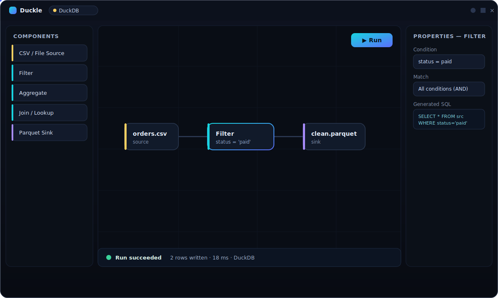

<div align="center">


<h3>Clean data in. Smart data out.</h3>

<p><b>Duckle</b> is an open-source, local-first <b>ETL / ELT / streaming studio</b> — a drag-and-drop pipeline designer that runs at native speed on your machine and ships as a tiny desktop app. Build pipelines visually, see the data at every step, and pump clean data into files, databases, the cloud, and your <b>AI / vector stores</b>.</p>

<p>


</p>

</div>

---

## Status

Duckle is in **early development**. The visual designer, the DuckDB execution engine, scheduling, and cloud sources work today and are covered by integration tests — but the surface is moving fast, the data-connector catalog is still growing, and APIs may change. Treat it as a promising daily-driver-in-progress, not a 1.0.

> **Honest scope:** Duckle is a *single-machine, embedded* studio. It's built to make local and small-team data work fast and pleasant — not to replace a distributed warehouse. If you outgrow one machine, point Duckle's output at the system that scales.

---

## What is Duckle?

A lot of data tooling is either a heavyweight enterprise suite or a pile of scripts. Duckle aims for the sweet spot:

- **Visual, but real.** Drag nodes onto a canvas, wire them up, and Duckle compiles the graph to SQL and runs it on a genuine analytical engine. No black box — click any node to see the **generated SQL** and a **live preview** of its rows.
- **Local-first and tiny.** The app is a **~9 MB** binary. It does not bundle a database — on first launch it downloads its engine (DuckDB) into your app directory with a guided step. Your pipelines, connections, and schedules live in a plain folder you choose, so they're **git-friendly**.
- **Fast.** Execution runs natively through DuckDB, so a CSV → transform → Parquet job that would crawl in a spreadsheet finishes in milliseconds.

```
        ┌────────────┐      ┌─────────────────┐      ┌──────────────┐
        │  messy.csv │ ───▶ │  clean · dedup  │ ───▶ │  Parquet /   │
        │  S3 · API  │      │  validate · map │      │  AI / vector │
        └────────────┘      └─────────────────┘      └──────────────┘
                drag            drop & wire              run locally
```

---

## Clean the garbage before it poisons your AI

Models are only as good as the data behind them. RAG indexes, embedding stores, and training sets quietly fill up with **duplicates, nulls, malformed rows, mixed encodings, and inconsistent schemas** — garbage in, garbage out.

Duckle is built to scrub that data clean *before* it reaches your AI:

- **Deduplicate** exact and near-duplicate rows.
- **Validate & filter** out malformed, empty, or out-of-range records with a visual rule builder.
- **Normalize** types, encodings, casing, and null handling across messy sources.
- **Reshape** — project, rename, map expressions, aggregate, and join reference data.
- **Export clean** to the columnar formats (Parquet, JSON) and stores that AI / vector databases ingest.

> **Today:** clean and export to Parquet/JSON that your vector store or AI database loads.
> **On the roadmap:** native sinks for vector / AI databases (e.g. pgvector and friends) so the clean data lands in one drag.

---

<div align="center">

<br/>
<sub><i>The Duckle designer (illustration). Real screenshots below.</i></sub>
</div>

---

## Why Duckle?

| | |
|---|---|
| 🎯 **Visual, not opaque** | Compile the canvas to SQL you can read. Preview every node's output. |
| 🪶 **Tiny binary** | ~9 MB app; the engine downloads on first run instead of being bundled. |
| ⚡ **Native speed** | DuckDB does the heavy lifting — vectorized, columnar, local. |
| 🗂️ **Git-friendly workspace** | Pipelines and config are plain files in a folder you pick. |
| 🔌 **Pluggable engines** | DuckDB today; SlothDB optional; a native Rust engine coming. |
| 🌫️ **AI-data ready** | Dedup, validate, normalize — prep clean datasets for AI / vector DBs. |
| 🖥️ **Feels native** | Frameless window, dark/light themes, no browser-wrapper vibe. |
| 🆓 **Open source** | MIT OR Apache-2.0. Yours to use, fork, and extend. |

---

## Features

| Area | What you get |
|---|---|
| **Designer** | Drag-and-drop canvas, snap-to-grid, node search, live validation, generated-SQL inspector, per-node preview tab. |
| **Sources** | CSV · TSV · Parquet · JSON / NDJSON · SQLite · DuckDB · S3 · GCS · Azure Blob · HTTP(S). |
| **Transforms** | Filter (visual + raw SQL) · Map / expressions · Aggregate · Join & Lookup (auto-detected) · Project · Rename · Sort · Distinct · Union. |
| **Sinks** | CSV · Parquet · JSON · SQLite · DuckDB · S3 / GCS / Azure. |
| **Run** | Streaming run events (nodes light up stage-by-stage), per-node row counts, **mid-query cancel**, run history. |
| **Schedules** | Cron · fixed interval · file-watch triggers, with an in-process scheduler. |
| **Cloud** | Saved connections become DuckDB secrets; cloud reads via `httpfs`. |
| **Workspace** | Connections, contexts (env vars), documents (Markdown), routines — all persisted per-pipeline as plain files. |

---

## Engines

Duckle ships a thin shell and installs its engine on first launch, so the download stays tiny.

| Engine | Role | Status | Source |
|---|---|---|---|
| **DuckDB** | Default execution engine — analytics, file formats, SQL pushdown. | ✅ Working | Downloaded from [duckdb/duckdb](https://github.com/duckdb/duckdb) releases |
| **SlothDB** | Optional embedded analytical engine. | 🧪 Installable | Downloaded from [SouravRoy-ETL/slothdb](https://github.com/SouravRoy-ETL/slothdb) releases |
| **Native** | In-process Rust streaming / incremental engine. | 🛠️ Coming soon | Built in |

Both engines install through the same guided first-run step, with a progress bar — no manual setup.

---

## Try it in 60 seconds

1. **Download** the latest release for your OS (or build from source below).
   - Windows: `Duckle_x64-setup.exe` (installer) or the standalone `duckle.exe`.
2. **Launch it.** On first run, Duckle asks to install its engine — click **Install DuckDB** (a ~10–20 MB download with a progress bar).
3. **Pick a workspace folder** — this is where your pipelines live.
4. **Build a pipeline:**
   - Drag a **CSV source** in, point it at [`samples/orders.csv`](samples/orders.csv), hit **Autodetect schema**.
   - Drag a **Filter**, wire it up, add a condition like `status = paid`.
   - Drag a **Parquet sink**, choose an output path.
   - Press **▶ Run** — watch the nodes light up, then check the **Output** tab.

That's a real, native ETL pipeline — built, run, and verified in under a minute.

---

## Screenshots

> 📸 Add your captures to `docs/assets/` as `screenshot-designer.png`, `screenshot-run.png`, and `screenshot-setup.png` and they'll render here.

<!--
<p align="center">
  <br/>
  <br/>
  
</p>
-->

---

## Build from source

**Prerequisites**

- [Rust](https://rustup.rs/) (stable)
- [Node.js](https://nodejs.org/) 18+ and npm
- [`cargo-tauri`](https://tauri.app/) CLI: `cargo install tauri-cli --version "^2"`
- Platform webview deps per the [Tauri prerequisites](https://tauri.app/start/prerequisites/) (WebView2 on Windows is preinstalled on Win10/11).

**Clone & install**

```bash
git clone https://github.com/SouravRoy-ETL/duckle
cd duckle
npm --prefix frontend install
```

**Run in development** (hot-reloading frontend + native shell):

```bash
cargo tauri dev
```

**Build a release binary + installers:**

```bash
cargo tauri build
```

Outputs land in `target/release/` (the standalone `duckle.exe`) and `target/release/bundle/` (the `.msi` / NSIS `-setup.exe` installers).

> The engine is **not** compiled in — DuckDB downloads at first launch. That's why the build is fast and the binary is tiny.

**Run the tests:**

```bash
cargo test                      # unit + plan/compile tests (no engine needed)
# end-to-end tests drive a real DuckDB CLI:
DUCKLE_DUCKDB_BIN=/path/to/duckdb cargo test
```

---

## Architecture

```
duckle/
├─ apps/desktop/         Tauri 2 shell — commands, engine installer, window
├─ frontend/             React 19 + Vite + TypeScript — the designer UI
└─ crates/
   ├─ duckdb-engine/     Compiles the node graph to SQL + drives the DuckDB CLI
   ├─ slothdb-engine/    SlothDB adapter
   ├─ scheduler/         Cron / interval / file-watch triggers
   ├─ metadata/          Schema & type model
   ├─ plugin-sdk/        Connector / inspector traits
   ├─ connectors/        Source/sink connectors
   └─ runtime · workflow-engine · transform-engine · stream-engine · execution-core
```

- **Frontend** (React + [@xyflow/react](https://reactflow.dev/)) is the visual designer; it talks to the Rust core over Tauri commands.
- **`duckdb-engine`** compiles the pipeline graph to SQL and executes it by **shelling out to the downloaded DuckDB CLI** (streaming results, cancel = kill the process) — no statically linked database, so the binary stays small.
- **Everything persists** to a workspace folder you choose, as plain JSON/Markdown files.

---

## Roadmap

- [ ] Native vector / AI-database sinks (pgvector and friends)
- [ ] In-process **Native** Rust streaming engine
- [ ] More connectors (databases, REST/APIs, message queues)
- [ ] Incremental / change-data pipelines
- [ ] Richer data-quality + profiling components
- [ ] Plugin marketplace via the connector SDK

---

## Contributing

Contributions, issues, and ideas are welcome — Duckle is young and there's a lot of green field. Open an issue to discuss a change before a large PR, match the existing code style, and keep changes focused. Run `cargo test` and `npm --prefix frontend run build` before submitting.

---

## License

Licensed under either of **MIT** or **Apache-2.0** at your option.

---

<div align="center">
<sub>Built with Rust · Tauri · React · DuckDB — by <a href="https://github.com/SouravRoy-ETL">Sourav Roy</a></sub>
</div>

<!-- Suggested GitHub topics: etl, elt, data-engineering, data-pipeline, duckdb, rust, tauri, react, typescript, local-first, embedded, drag-and-drop, data-cleaning, vector-database, ai, streaming, desktop-app -->
