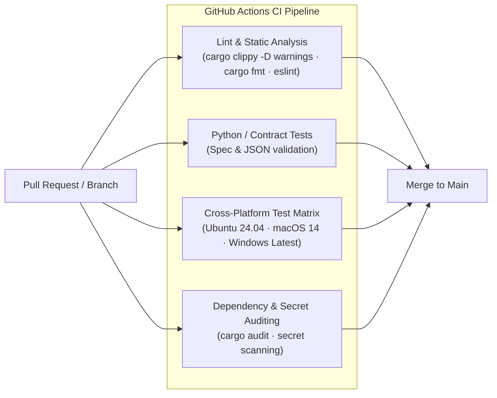

# Secure Software Development Lifecycle (SSDLC) & TDD Philosophy

This document explains the software engineering practices, security verification mechanisms, and Test-Driven Development (TDD) discipline underpinning the Duckle codebase.

---

## 1. TDD-Driven Engineering Discipline

Duckle applies strict **Test-Driven Development (TDD)** to ensure behavioral stability, eliminate regressions, and prevent security bypasses.

```text
┌────────────────────────┐     ┌────────────────────────┐     ┌────────────────────────┐
│ 1. Red (Failing Test)  │────►│ 2. Green (Min Impl)    │────►│ 3. Refactor & Lint     │
│ Write contract test    │     │ Implement minimum safe │     │ Run clippy, fmt, &     │
│ asserting auth/spec    │     │ logic to pass test     │     │ address warnings       │
└────────────────────────┘     └────────────────────────┘     └────────────────────────┘
            ▲                                                              │
            └──────────────────────────────────────────────────────────────┘
```

### Key TDD Practices in Duckle
* **Security & Auth Contract Tests**: Handlers and middleware are accompanied by negative test cases verifying that invalid tokens, expired sessions, and insufficient roles return HTTP `401 Unauthorized` or `403 Forbidden` and write corresponding denial events to `audit.ndjson`.
* **Connector Specification Verification**: Connectors implement contract assertions preventing unknown property fields from passing silently into backend execution plans.
* **Hermetic Integration Tests**: Engine execution tests use mock servers and loopback addresses, preventing unmonitored external network calls during automated test suites.

---

## 2. Multi-Tiered Continuous Integration (CI) Pipeline

Every pull request and merge to `main` executes a multi-OS validation pipeline configured in `.github/workflows/ci.yml`:



### Static Analysis & Linter Gates
* **Rust Clippy**: Enforced with `-D warnings` across the entire workspace. Unsafe blocks, unchecked arithmetic, and resource leaks fail the build immediately.
* **Rustfmt & Prettier**: Automated formatting enforcement guarantees code readability and clean git diffs.
* **Frontend TypeScript & ESLint**: Strict type checking prevents prototype pollution, `any` leakage, and XSS risks in the React/Tauri interface.

---

## 3. Dependency Management & Supply Chain Security

To protect against software supply chain attacks and vulnerable dependencies:

* **Cryptographic Dependency Pinning**: `Cargo.lock` and `package-lock.json` lock exact package hashes across builds.
* **Automated Vulnerability Alerts**: GitHub Dependabot scans dependency manifests continuously, raising automated PRs for CVE remediation.
* **Minimal Native C Dependencies**: Duckle prioritizes pure-Rust drivers (e.g. `rskafka`, `async-nats`, `lapin`) to avoid vulnerable C/C++ FFI dependencies and simplify cross-compilation.
* **Release Provenance**: Published binaries are compiled on clean GitHub runner environments, accompanied by cryptographic `SHA256SUMS.txt` manifests.
