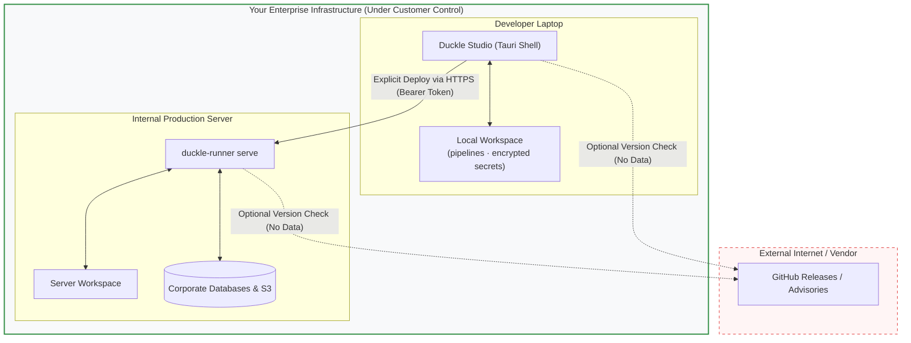

# Trust Boundary & Threat Model

This document explains the security architecture of Duckle, analyzing its trust boundary, data flow isolation, and threat model.

---

## 1. Architectural Philosophy: The Local-First Boundary

Duckle is architected as an **embedded, local-first ETL/ELT studio and runtime**. It is deliberately not a multi-tenant cloud service.

### The "We Hold Nothing" Invariant
* **Zero Vendor Data Transit**: No dataset rows, SQL queries, database credentials, or execution logs are ever transmitted to SlothFlowLabs or any third-party infrastructure.
* **No Vendor Sub-processors**: There are no cloud servers, multi-tenant databases, or analytics aggregators maintained on the vendor side.
* **Network Isolation**: The only outbound network call made by Duckle out-of-the-box is a simple HTTP GET request to check for new release versions on GitHub. This request can be completely blocked at the firewall with zero degradation of functionality.

---

## 2. Threat Modeling: STRIDE Matrix Analysis

We evaluate Duckle's threat vectors using the STRIDE methodology:

| Threat Category | Potential Attack Vector | Duckle Architectural Mitigation |
| :--- | :--- | :--- |
| **Spoofing** | Attacker attempts to impersonate an administrator on Duckle Server. | Bearer token authentication with cryptographically random Base64url tokens. Server stores only SHA256 hashes of minted keys. |
| **Tampering** | In-transit tampering with pipelines or unauthorized modification of schedules. | Atomic pipeline deployment (staged in memory/temporary files, verified, then renamed). Deployed schedules arrive **forced disabled** (`enabled: false`), requiring human operational enablement. |
| **Repudiation** | An operator triggers an unauthorized query or cancels a production job and denies it. | Append-only `audit.ndjson` records actor identity, role, target URL, timestamp, and outcome (`allowed`, `denied`, `unauthenticated`). |
| **Information Disclosure** | Hardcoded production database credentials checked into Git or stored in pipeline JSON. | Deployment sanitizer strips cached sample rows (`sampleRows`). Cleartext password fields are rejected by the pre-flight builder; `${ENV:VAR}` interpolation keeps secrets in the host environment. |
| **Denial of Service** | Resource exhaustion via runaway database queries or large memory ingestion. | Embedded DuckDB engine executes out-of-core streaming algorithms with configurable memory limits. Stop button and `cancel` APIs interrupt running threads. |
| **Elevation of Privilege** | A user with `viewer` role attempts to execute shell/SQL or deploy arbitrary code. | Strict route-level RBAC enforced before handler execution. Refusals are recorded in the audit trail. |

---

## 3. The 15-Minute First-Run Claim Window

When `duckle-runner serve` is launched for the very first time on a fresh workspace:
1. It exposes an unauthenticated `/setup` endpoint.
2. A **15-minute time window** is opened to allow the desktop studio wizard to claim the instance and mint the initial administrator token.
3. If not claimed within 15 minutes, the server shuts down the setup endpoint to prevent unauthorized takeover.
4. Once claimed, the server replies `410 Gone` to all subsequent setup requests permanently.
