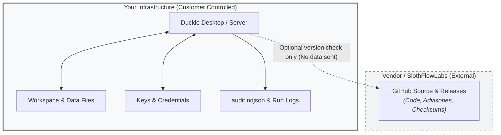

# Security, Governance & Compliance Documentation

Welcome to the Duckle Security, Governance & Compliance documentation suite. This documentation is organized using the **[Diátaxis Framework](https://diataxis.fr/)**, separating content into four distinct modes to serve different needs: **Tutorials** (learning-oriented), **How-To Guides** (task-oriented), **Reference** (information-oriented), and **Explanation** (understanding-oriented).

---

## The Diátaxis Navigation Map

```text
               PRACTICAL                   THEORETICAL
       ┌───────────────────────────┬───────────────────────────┐
       │                           │                           │
       │        TUTORIALS          │        EXPLANATION        │
       │   (Learning-oriented)     │  (Understanding-oriented) │
       │                           │                           │
STEP   ├───────────────────────────┼───────────────────────────┤   CONCEPT
BY     │                           │                           │
STEP   │       HOW-TO GUIDES       │         REFERENCE         │
       │      (Task-oriented)      │   (Information-oriented)  │
       │                           │                           │
       └───────────────────────────┴───────────────────────────┘
```

---

## 1. [Tutorials](tutorials/) (Learning-Oriented)
Practical, end-to-end learning experiences designed to help you build competence with security workflows in Duckle:

* **[Authoring Secure Data Pipelines](tutorials/secure-pipeline-authoring.md)**: Walk through designing an enterprise ETL pipeline with zero credential leakage, environment variable resolution, and QA data sanitization.
* **[Ingesting Security Audit Logs into a SIEM](tutorials/audit-logging-siem-tutorial.md)**: Step-by-step tutorial on triggering authenticated actions in Duckle Runner and observing structured audit records in real time.

---

## 2. [How-To Guides](how-to/) (Task-Oriented)
Direct, step-by-step instructions to solve specific operational security problems:

* **[How to Configure Secrets Management](how-to/configure-secrets-management.md)**: Store encrypted connection profiles, manage workspace keys, and supply production secrets securely via runtime environment variables.
* **[How to Report and Patch Vulnerabilities](how-to/vulnerability-reporting-patching.md)**: Follow disclosure procedures, verify binary checksums, and apply emergency security updates without downtime.
* **[How to Integrate Audit Logs with SIEM using Vector](how-to/siem-vector-integration.md)**: Forward append-only `audit.ndjson` events to Datadog, Splunk, AWS CloudWatch, and Elasticsearch.
* **[How to Execute Incident Response Runbooks](how-to/incident-handling-runbook.md)**: Step-by-step containment procedures for compromised tokens, workspace access breaches, and forensic audits.

---

## 3. [Reference](reference/) (Information-Oriented)
Authoritative, factual technical specifications, schemas, and control matrices:

* **[SOC 2 & ISO 27001 Control Matrix](reference/soc2-iso27001-control-matrix.md)**: Detailed mapping of Duckle capabilities against SOC 2 Type II Trust Services Criteria and ISO/IEC 27001:2022 Annex A controls.
* **[Security Audit Event Schema](reference/audit-event-schema.md)**: The JSON field definitions, actor attribution rules, and complete action dictionary for `audit.ndjson`.
* **[Okta SSO & MFA Integration Specification](reference/sso-okta-architecture-spec.md)**: Architectural roadmap specification for OIDC/SAML 2.0 authentication, Okta Verify MFA, and IdP group-to-role mappings.
* **[Security CLI Reference](reference/security-cli-reference.md)**: Command-line reference for `duckle-runner console key-add`, key revocation, and CLI audit inspections.

---

## 4. [Explanation](explanation/) (Understanding-Oriented)
Discussions of architecture, design philosophy, and security models:

* **[Trust Boundary & Threat Model](explanation/trust-boundary-and-threat-model.md)**: Why Duckle is local-first/self-hosted, our "we hold nothing" architectural boundary, and the shared responsibility model.
* **[SSDLC & TDD Philosophy](explanation/ssdlc-and-tdd-philosophy.md)**: Test-driven security engineering, cross-platform contract testing, static analysis gates, and supply chain provenance.
* **[Encryption & Key Hierarchy](explanation/encryption-and-key-hierarchy.md)**: Deep dive into AES-256-GCM encryption, workspace key lifecycle, and memory hygiene.

---

## Core Security Stance: The Local-First Boundary

Duckle is **software you deploy and run yourself on infrastructure you control**:



1. **Zero Vendor Telemetry**: Duckle never receives, processes, or stores your pipeline payloads, credentials, or logs.
2. **Deterministic Pipelines**: Data transformation runs in-process via embedded DuckDB without third-party cloud intermediaries.
3. **Auditable Source**: All binaries and container images are built transparently from open-source repositories with strict cryptographic checksums.
