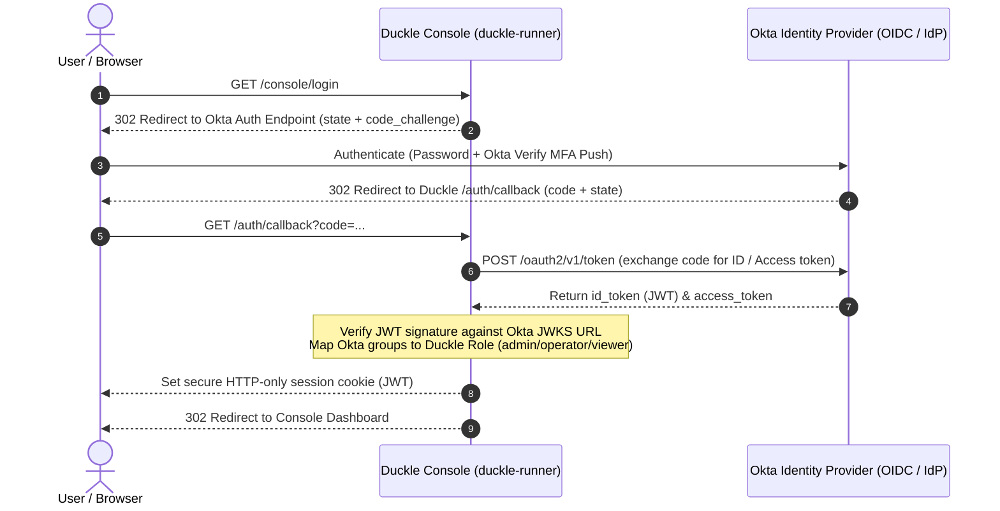

# Okta SSO & MFA Architecture Specification (Roadmap)

This document is the technical specification for the planned **Single Sign-On (SSO)** and **Multi-Factor Authentication (MFA)** integration with **Okta** and other standard identity providers (IdPs) via OpenID Connect (OIDC) and SAML 2.0.

---

## 1. Overview & Architecture

To support enterprise identity standards, `duckle-runner serve` will support delegating user authentication to an enterprise Identity Provider (IdP) such as Okta, Azure AD (Entra ID), or Google Workspace.



---

## 2. Authentication Protocols

### Supported Protocols
1. **OpenID Connect (OIDC) Core 1.0 (Primary)**:
   * **Flow**: Authorization Code Flow with Proof Key for Code Exchange (PKCE) (RFC 7636).
   * **Client Type**: Confidential client with client secret or PKCE public client.
2. **SAML 2.0 Web Browser SSO (Secondary)**:
   * **Profile**: SP-Initiated SSO with HTTP-POST / HTTP-Redirect bindings.

---

## 3. Role-Based Access Control (RBAC) Claim Mapping

Duckle will map claims extracted from the IdP `id_token` (`groups` claim) directly to internal Duckle roles:

| Okta Group Claim | Duckle Assigned Role | Granted Permissions |
| :--- | :--- | :--- |
| `Duckle-Admins` | `admin` | Full administrative control: deploy pipelines, modify schedules, manage keys, inspect audit logs. |
| `Duckle-Operators` | `operator` | Operational control: trigger pipeline runs, cancel jobs, enable/disable schedules. |
| `Duckle-Viewers` | `viewer` | Read-only access: view run history, inspect active pipelines, review metrics. |

---

## 4. Multi-Factor Authentication (MFA) Enforcement

* **IdP Delegated MFA**: MFA is enforced upstream by Okta policies (Okta Verify, FIDO2 / WebAuthn, hardware security keys, or TOTP).
* **`amr` Claim Validation**: Duckle's callback handler validates the Authentication Method Reference (`amr`) and Authentication Context Class Reference (`acr`) claims to ensure step-up MFA occurred before granting `admin` role sessions.

---

## 5. Configuration Specification

When enabled, the server will be configured via workspace settings (`config.json`) or environment variables:

```ini
# Okta OIDC Configuration
DUCKLE_AUTH_PROVIDER=oidc
DUCKLE_OIDC_ISSUER=https://example.okta.com/oauth2/default
DUCKLE_OIDC_CLIENT_ID=0oa1234567890abcdef
DUCKLE_OIDC_CLIENT_SECRET=${ENV:OKTA_CLIENT_SECRET}
DUCKLE_OIDC_REDIRECT_URI=https://duckle.internal.net/auth/callback
DUCKLE_OIDC_GROUPS_CLAIM=groups

# Role Mapping Rules
DUCKLE_ROLE_MAP_ADMIN="Duckle-Admins,DataEng-Leads"
DUCKLE_ROLE_MAP_OPERATOR="Duckle-Operators,DataOps-Team"
DUCKLE_ROLE_MAP_VIEWER="Duckle-Viewers,BI-Analysts"
```

---

## 6. Audit & Identity Attribution

When SSO is active, the `actor` field in `<workspace>/logs/audit.ndjson` will record the authenticated corporate email address (from `email` or `preferred_username` claim) instead of static local labels:

```json
{
  "at": "2026-08-30T14:50:00.000Z",
  "actor": "alice.engineer@company.com",
  "role": "admin",
  "action": "POST",
  "target": "/api/deploy",
  "outcome": "allowed"
}
```
